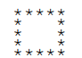

<!-- 
_paginate: false
_class: invert
-->

# <!--fit--> Discussion 07
<!-- 
_footer: "Credits to Adit Bala for his Marp template"
-->

### 

Brian Lau
`blau1@umd.edu`

---
## Agenda
<!-- 
_footer: "Slides available at [`beelau.vercel.app`](https://beelau.vercel.app)"
-->
1. Project 3 Questions
2. Methods! (not programs :0 what a surprise)
    - We'll do these together but I will need your help.
    - Please answer my questions when I ask them so we don't sit here awkwardly
3. Office Hours / Lecture Review
---
## Announcements :mega:
- `Project 3`
    - Due `Monday, Feb 26, 11:30 pm` 
    - Note: it's 11:30 not 11:59 
- `Quiz 1` Regrade Requests
    - Due `Friday, Feb 23, 11:59 pm`
- `Quiz 2` 
    - This `Friday, Feb 23` in lecture
    - Practice quiz:`Thursday, Feb 22`
- Remind Brian of your name

---

# Static Methods!
- We're going to be creating multiple different static methods, hitting on topics like loops again
    - You've seen them before like in Project 2 :)
    - Let's start out by creating a `Utilities.java` file and a `Driver.java` file
        - Your methods will be written in `Utilities.java` and called in `Driver.java`

---
# 1. Maximum
 Write a static method called `maximum()` that takes three integer parameters and returns the maximum value.

---

# 2. Vowels
Write a static method called `getNumberVowels()` that takes a string as a parameter and returns the number of vowels in the string. The method will return -1 if the parameter is null.
- Use what we talked about last class with `.charAt()`
- And no, we are not including `y` as a vowel

---
# 3. Random Square
Write a static method called `drawSquare()` that takes a number of rows and two characters are parameters. The method will return a string with a square with the specified number of rows, picking randomly between the two characters specified via the parameters. 
-   Use the Random class `nextBoolean()` method to pick between the two characters. 

---

# 4. Rewrite me
Rewrite the previous static method by adding a private method called `areParametersValid()` that takes a number of rows and two characters as parameters. 
- The method will return true if the parameters are valid and false otherwise. 
- The parameters will be considered valid if the number of rows is greater than or equal to two and if the two characters are different. 
- Rewrite the `drawSquare()` method using this private method. 

---
# 5. Square Borders
Write a static method called drawSquareBorders that takes a number of rows and a character as a parameter. The method will return a string with the border of the square. 
- The following is an example with five as the number of rows: 

---

# Thank you! Any questions?

### Remember to give feedback if you have any!
