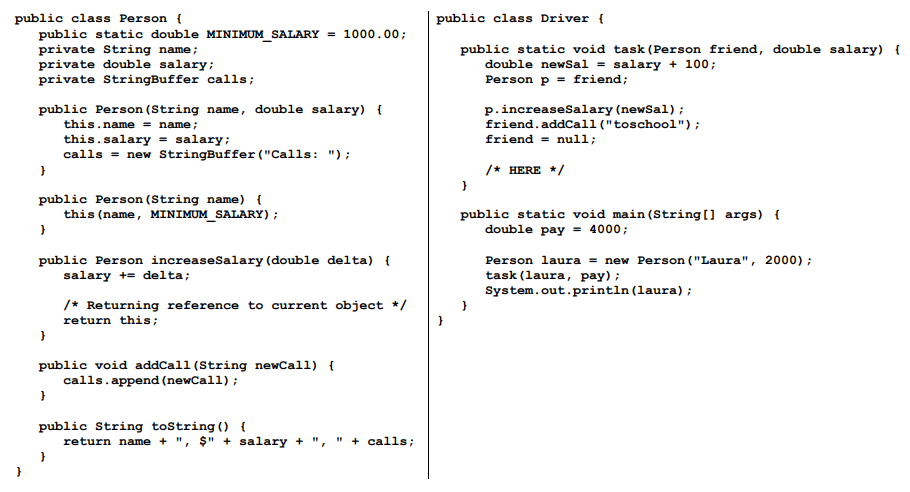
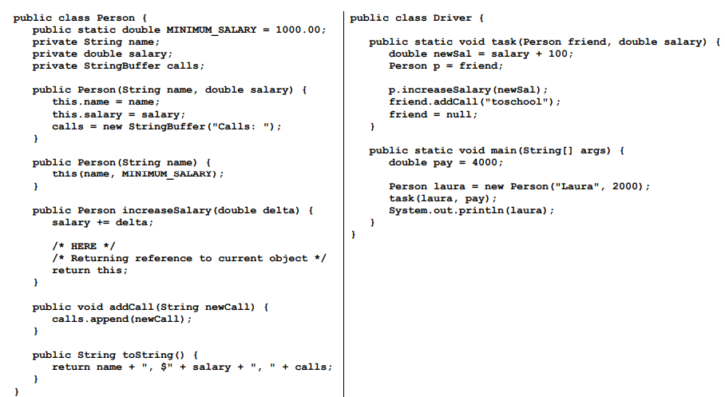

<!-- 
_paginate: false
_class: invert
-->

# <!--fit--> Discussion 13
<!-- 
_footer: "Credits to Adit Bala for his Marp template"
-->

### 

Brian Lau
`blau1@umd.edu`

---
## Agenda
<!-- 
_footer: "Slides available at [`beelau.vercel.app`](https://beelau.vercel.app)"
-->
2. Memory Map Review
3. Classes Extended 
    - Now with 60% more classes!
4. Office Hours / Lecture Review
---
## Announcements :mega:
- `Quiz 3`
    - `Wednesday March 13th, 2024`
- Remind Brian of your name!

---
# Memory Diagrams
- Quick review and then let's draw 3 examples
---
# Example 1:
```
public class Driver {
    
 public static int sumOfSquares(int x, int y) {
    int answer;
    answer = x * x + y * y;
    /* HERE */
    return answer;
 }

 public static void main(String[] args) {
    int a = 3, b = 4, result;
    result = sumOfSquares(a, b);
    System.out.println("Answer: " + result);
 }

}
```
----

# Example 2:


----

# Example 3:



# Classes, classes, classes (again)!
- We're going to be extending the class from last week!

---
# 1. Residents, Residents, Residents
- We're going to implement a new `StringBuffer` field for our residents
    - We're going to have to create some new methods as well
        - Can we think of any :) 

---

# 2. Modified toString() and addResident()
- We should have a way to add residents
    - Our new residents should also be represented in the `toString()`

---
# 3. Constructors (Default & Copy)
- Let's add 2 new constructors: Default and Constructor
    - What are the parameters of each one?
    - The keen eye will notice we had a default one before. I wonder what happened to it?

---
# 4. equals()
- Let's create a method to show if two buildings are equal
    - Finally, another `Driver3.java` file to show off all of this
---
# 5. Memory Map
- Let's show off a memory map of a sample run of our new buildings.
```
	public static void main(String[] args) {
		Building iribe = new Building("Iribe", 5);
		iribe.addResident("Mary");
		iribe.addResident("Rose"); /* STOP Drawing before returning from addResident */
		
		System.out.println(iribe);
	}
```
---

# Thank you! Any questions?

### Remember to give feedback if you have any!
